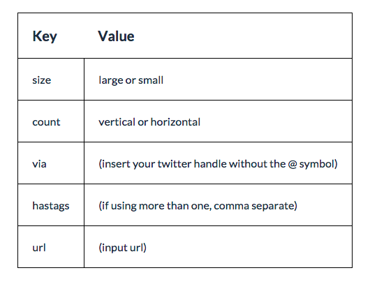

#**tweetIt.js** jQuery Plugin

##Usage

**Tweet It** allows you to easily add a twitter button alongside any text on your website that you want to allow a user to tweet out. Upon clicking the tweet button, the pre-selected text will appear in a pop-up twitter box. The user clicks 'tweet' and voilà!

##Download

You will need to download **jquery.tweetIt.js** and place the file into your JavaScript folder in your root directory. An example path:

	ProjectMainFolder > js > jquery.tweetIt.js

##The Setup

Next, you will want to make sure to link **jQuery** in your HTML file, along with **jquery.tweetIt.js.** Place these links **at the bottom**, just before your closing body tag, and make sure to place the plugin script *after* the jQuery script.

###HTML

	
	
	</body>

##Initialization

In order to initialize **jquery.tweetIt.js**, copy and paste the following code into your main JavaScript file.

If you already have your document ready function, simply call the function inside of it by copying and pasting just the middle line of code.

###JavaScript

	$(function(){
		$('.tweetButton').tweetIt();
	});

##Customization

The default settings for the plugin provide you with simply the text when you click on the tweet button. However, you also have multiple options to customize your tweet.

In order to do so, simply place an object inside the jquery.tweetIt.js function we called earlier (as shown below), and insert your chosen customization.

###Default<
	
	$(function(){
		$('.tweetButton').tweetIt(
			size: 'large',
			count: 'none',
			via: '',
			hashtags: '',
			url: null
		);
	});

###Sample Options

	
		
	$(function(){
		$('.tweetButton').tweetIt(
			size: 'small',
			count: 'horizontal',
			via: 'twitterdev',
			hashtags: 'test, demo',
			url: 'http://twitter.com'
		);
	});

##And Finally

You simply place a class of tweetButton to any element containing text that you wish to allow the user to tweet, and a button will appear alongside of it.

	<h2 class="tweetButton">Love twitter? Use this dynamic jQuery plugin to make any text on your page tweetable!</h2>

And you're done!

*Remember* Tweets can only be 140 characters, so make sure the text you are selecting is no longer than that (especially if you are including a url, via and/or hashtags), or else the user will have to edit the tweet.